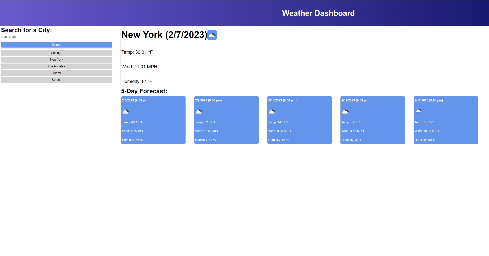

# <Weather Dashboard>

## Description

Uses the OpenWeather API to create a simple weather app. Users can input a city and get current weather data for that city as well as a five-day forecast. Weather/forecast data includes temperatures, wind speeds, humidity, and general cloudiness/precipitation conditions. Previously searched cities are saved to local storage and populated into shortcut buttons.

## Link

https://jmulcahy92.github.io/Weather-Dashboard/

## Screenshot

## Installation

N/A

## Usage

N/A

## Credits

N/A

## License

MIT License

Copyright (c) 2023 jmulcahy92

Permission is hereby granted, free of charge, to any person obtaining a copy
of this software and associated documentation files (the "Software"), to deal
in the Software without restriction, including without limitation the rights
to use, copy, modify, merge, publish, distribute, sublicense, and/or sell
copies of the Software, and to permit persons to whom the Software is
furnished to do so, subject to the following conditions:

The above copyright notice and this permission notice shall be included in all
copies or substantial portions of the Software.

THE SOFTWARE IS PROVIDED "AS IS", WITHOUT WARRANTY OF ANY KIND, EXPRESS OR
IMPLIED, INCLUDING BUT NOT LIMITED TO THE WARRANTIES OF MERCHANTABILITY,
FITNESS FOR A PARTICULAR PURPOSE AND NONINFRINGEMENT. IN NO EVENT SHALL THE
AUTHORS OR COPYRIGHT HOLDERS BE LIABLE FOR ANY CLAIM, DAMAGES OR OTHER
LIABILITY, WHETHER IN AN ACTION OF CONTRACT, TORT OR OTHERWISE, ARISING FROM,
OUT OF OR IN CONNECTION WITH THE SOFTWARE OR THE USE OR OTHER DEALINGS IN THE
SOFTWARE.